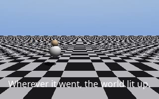
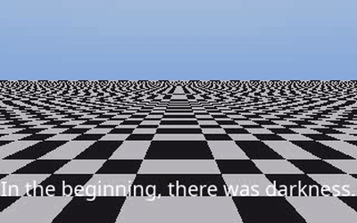

<p align="center">
  
</p>

<h1 align="center">JusAnim</h1>

<p align="center">
  <i>Tiny procedural animation library.<br>Pure Python + ffmpeg. No dependencies, no excuses.</i>
</p>

<p align="center">
  
  
  
  
</p>

---

## ✦ What it is

Two tiny engines that turn JSON scripts into finished short films:

<table>
<tr>
<td width="50%">

### `2d/` — pixel story engine
A grid world where a single pixel paints the universe. Synthesized score included.


</td>
<td width="50%">

### `3d/` — sphere world engine
Raytraced sphere people on a checkered plane, orbiting cameras, JSON-driven.



</td>
</tr>
</table>

## ✦ Quickstart

```bash
cd 3d
python3 storyvid.py last_pixel_3d.json out.mp4
```

Every beat of a story is one JSON object:

```json
{ "caption": "Then the Void came.", "white": 0, "void": {"x": 3.0, "r": 1.5}, "hop": true }
```

`x` positions, the void's `{x, r}`, visibility (`null` hides), hop-walk cycles, captions — that's the whole API.

## ✦ The Last Pixel — in both dimensions

| | 2D | 3D |
|---|---|---|
| Engine | `2d/make_story.py` | `3d/storyvid.py` |
| Runtime | 36s | 12s |
| Audio | full score | compressed score |
| Script format | code edit + `caps3.txt` | `last_pixel_3d.json` |

## ✦ Videos

All finished renders attached to the [v1.0 release](https://github.com/shubh72010/JusAnim/releases/tag/v1.0).

## ✦ Roadmap

- [ ] more actors, colors, and cameras in the 3D engine
- [ ] a proper scene DSL parsing scenes → JSON
- [ ] sprite shapes (squares, triangles) in the 2D engine
- [ ] audio narration

---

<p align="center"><i>Maybe the world just needs a fresh start.</i></p>
